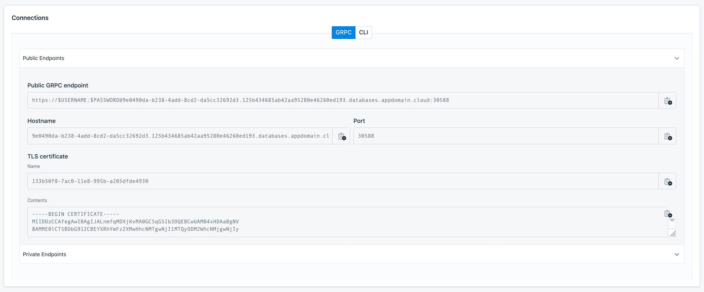

---
copyright:
  years: 2018,2019
lastupdated: "2019-04-10"

subcollection: databases-for-etcd

---

{:new_window: target="_blank"}
{:shortdesc: .shortdesc}
{:screen: .screen}
{:codeblock: .codeblock}
{:pre: .pre}
{:tip: .tip}


# Getting Credentials and Connection Strings
{: #connection-strings}

In order to connect to {{site.data.keyword.databases-for-etcd_full}}, you need credentials and some connection strings. A {{site.data.keyword.databases-for-etcd}} deployment is provisioned with a root user, and after you[set the root password](/docs/services/databases-for-etcd?topic=databases-for-etcd-root-password), you can use its connection strings to connect to your deployment.

Connection Strings for your deployment are displayed on the _Dashboard Overview_, in the _Connections_ panel. They can be used with any set of credentials that you generate.



You can also grab connection strings from the [CLI](/docs/databases-cli-plugin?topic=cloud-databases-cli-cdb-reference#deployment-connections) and the [API](https://{DomainName}/apidocs/cloud-databases-api#discover-connection-information-for-a-deployment-f-e81026).

## Credentials and Connection Strings for additional users

Access to your {{site.data.keyword.databases-for-etcd}} deployment is not just limited to the root user. You can create additional users and retrieve connection strings specific to them by using the _Service Credentials_ panel, the {{site.data.keyword.IBM_notm}} CLI, or through the {{site.data.keyword.IBM_notm}} {{site.data.keyword.databases-for}} API. 

## Generating Connection Strings from _Service Credentials_

1. Navigate to the service dashboard for your service.
2. Click _Service Credentials_ to open the _Service Credentials_ panel.
3. Click **New Credential**.
4. Choose a descriptive name for your new credential. 
5. (Optional) Specify whether the new credentials use a public or private endpoint. Use either `{ "service-endpoints": "public" }` / `{ "service-endpoints": "private" }` in the _Add Inline Configuration Parameters_ field to generate connection strings using the specified endpoint. Use of the endpoint is not enforced. It just controls which hostnames are in the connection strings. Public endpoints are generated by default.
6. Click **Add** to provision the new credentials. A username and password, and an associated etcd user is auto-generated.

The new credentials appear in the table, and the connection strings are available as a JSON object in the click-to-copy field under _View Credentials_.

### Using Service IDs

Because {{site.data.keyword.databases-for-etcd}} is an IAM service, you can use [Service IDs](/docs/iam?topic=iam-serviceids) to manage access to this service. For example, by using an IAM-managed Service ID, that user gets an etcd user and connection string in _Service Credentials_, and has API key access to the {{site.data.keyword.cloud_notm}} Databases API.  If you have a Service ID, enter its information under _Select Service ID_.

## Getting Credentials and Connection Strings from the command line

If you manage your service through the {{site.data.keyword.cloud_notm}} CLI and the cloud databases plug-in, you can generate a new user and connection strings with `cdb user-create`. For example, to create a new user for a deployment named "example-deployment", use the following command.

`ibmcloud cdb user-create example-deployment <newusername> <newpassword>`

The response contains the task `ID`, `Deployment ID`, `Description`, `Created At`, `Status`, and `Progress Percentage` fields. The `Status` and `Progress Percentage` fields update when the task is complete.

Once the task has finished, you can retrieve the new user's connection strings with the `ibmcloud cdb deployment-connections` command.

```
ibmcloud cdb deployment-connections example-deployment -u <newusername>
```
Or
```
ibmcloud cdb cxn example-deployment -u <newusername>
```

Full connection information is returned by the `ibmcloud cdb deployment-connections` command with the `--all` flag. To retrieve all the connection information for a deployment named  "example-deployment", use the following command.

```
ibmcloud cdb deployment-connections example-deployment -u <newusername> --all
```

If you don't specify a user, the `deployment-connections` commands return information for the root user by default.
{: .tip}

### Adding users to _Service Credentials_

Creating a new user from the CLI doesn't automatically populate that user's connection strings into _Service Credentials_. If you want to add them there, you can create a new credential with the existing user information.

Enter the user name and password in the JSON field _Add Inline Configuration Parameters_, or specify a file where the JSON information is stored. For example, `{"existing_credentials":{"username":"Robert","password":"supersecure"}}`.

Generating credentials from an existing user does not check for or create that user.
{: tip}

## Connection String Breakdown

### The `grpc` Section

The "grpc" section contains information that is suited to applications that make connections to etcd.

Field Name|Index|Description
----------|-----|-----------
`Type`||Type of connection - for etcd, it is "uri"
`Scheme`||Scheme for a URI - for etcd, it is "https"
`Path`||Path for a uri
`Authentication`|`Username`|The username that you use to connect.
`Authentication`|`Password`|A password for the user - might be shown as `$PASSWORD`
`Authentication`|`Method`|How authentication takes place; "direct" authentication is handled by the driver.
`Hosts`|`0...`|A hostname and port to connect to
`Composed`|`0...`|A URI combining Scheme, Authentication, Host, and Path
`Certificate`|`Name`|The allocated name for the self-signed certificate for database deployment
`Certificate`|Base64|A base64 encoded version of the certificate.
{: caption="Table 1. `etcd`/`URI` connection information" caption-side="top"}

* `0...` indicates that there might be one or more of these entries in an array.

### The CLI Section

The "CLI" section contains information that is suited for connecting with `etcdctl` .

Field Name|Index|Description
----------|-----|-----------
`Bin`||The recommended binary to create a connection; in this case it is `etcdctl`.
`Composed`||A formatted command to establish a connection to your deployment. The command combines the `Bin` executable, `Environment` variable settings, and uses `Arguments` as command-line parameters.
`Environment`||A list of key/values you set as environment variables.
`Arguments`|0...|The information that is passed as arguments to the command shown in the Bin field.
`Certificate`|Base64|A self-signed certificate that is used to confirm that an application is connecting to the appropriate server. It is base64 encoded.
`Certificate`|Name|The allocated name for the self-signed certificate.
`Type`||The type of package that uses this connection information; in this case `cli`. 
{: caption="Table 2. `etcdctl`/`cli` connection information" caption-side="top"}

* `0...` indicates that there might be one or more of these entries in an array.


## Getting Credentials and Connection Strings with the API

The _Foundation Endpoint_ that is shown on the _Overview_ panel of your service provides the base URL to access this deployment through the API. To create and manage users, use the base URL with the `/users` endpoint. Examples and documentation are available in the [API Reference](https://{DomainName}/apidocs/cloud-databases-api#creates-a-database-level-user).

To retrieve user's connection strings, use the base URL with the `/users/{userid}/connections` endpoint. Examples and documentation are also available in the [API Reference](https://{DomainName}/apidocs/cloud-databases-api#discover-connection-information-for-a-deployment-f-e81026).


