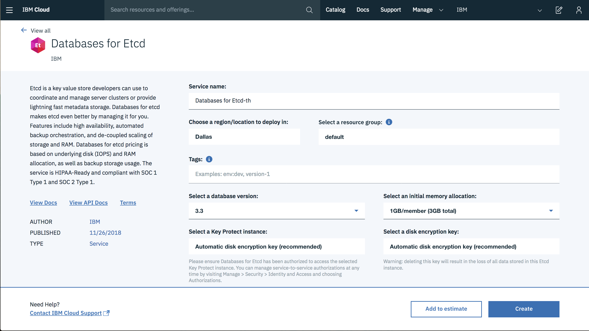

---

copyright:
  years: 2018
lastupdated: "2018-10-11"
---

{:shortdesc: .shortdesc}
{:new_window: target="_blank"}
{:codeblock: .codeblock}
{:pre: .pre}
{:screen: .screen}
{:tip: .tip}

# Provisioning {{site.data.keyword.databases-for-etcd}}

To create an {{site.data.keyword.databases-for-etcd_full}} deployment, you need to create an {{site.data.keyword.cloud}} service instance. A service instance can represent different types of service. The service type is determined by the service ID and you need to specify the appropriate service ID when you create a new service instance. The service ID for {{site.data.keyword.databases-for-etcd}} is `databases_for_etcd`.

## Using the catalog

You can create a {{site.data.keyword.databases-for-etcd}} service from the [{{site.data.keyword.databases-for-etcd}} page](https://{DomainName}/catalog/services/databases-for-etcd/) in the {{site.data.keyword.cloud_notm}} catalog.



When you create the deployment from the catalog, you need to specify the following parameters.

1. **The service name** - The name can be any string and is the name that is used on the web and in the command-line to identify the new database deployment.
2. **The region** - The region in which the database deployment resides.
3. **The database version** - The major version of the database to be created within the deployment. The latest minor version is always be used automatically. 

Users can optionally set:

1. **The resource group** - If you are organizing your services into [resource groups](/docs/resources/bestpractice_rgs.html#bp_resourcegroups), you can specify the resource group in this field. Otherwise, you can leave it at default.
2. **Disk encryption** - Optionally, a Key Protect instance can be selected if the user has Key Protect configured. If it is configured, once the service is selected, a disk encryption key can be selected from the Key Protect service. By default, Key Protect is not used and the deployment automatically creates and manages its own disk encryption key. 

Users cannot set:

1. **The service plan** - A service can have a number of plan types with different pricing, resources or other features, each with their own service plan ID. {{site.data.keyword.databases-for-etcd}} currently has one service plan, standard. 

Once you select the appropriate settings, click **Create** to start the provisioning process off.

The database takes some time to deploy. The user is navigated back to the {{site.data.keyword.cloud_notm}} Dashboard.

## Using the command-line

The {{site.data.keyword.cloud_notm}} CLI tool is what you use to communicate with {{site.data.keyword.cloud_notm}} from your terminal or command-line. For more information, see [Download and install {{site.data.keyword.cloud_notm}} CLI](https://{DomainName}/docs/cli/reference/bluemix_cli/download_cli.html).

To create a {{site.data.keyword.databases-for-etcd}} deployment, you use the CLI to request a service instance with a `databases-for-etcd` service ID.

The command template is:

```
ibmcloud resource service-instance-create <service-name> <service-id> <service-plan-id> <region>
```

More information about this command, in general, is available in the [CLI reference for resource groups](/docs/cli/reference/ibmcloud/cli_resource_group.html#ibmcloud_resource_service_instance_create).

In the specific case of creating a {{site.data.keyword.databases-for-etcd}} deployment, set the service name (quote any name with spaces in it). Then, set `databases-for-etcd` as the service ID. Enter `standard` for the service plan ID and `us-south` (or your region) for the region.

```
ibmcloud resource service-instance-create example-etcd databases-for-etcd standard us-south
```

When the command is run, provisioning the database deployment begins. The database takes some time to deploy. You can check on its progress on your {{site.data.keyword.cloud_notm}} Dashboard. You can also run:

```
ibmcloud resource service-instance <service-name>
```

This command reports the current state of the service instance.

### Additional parameters

The `service-instance-create` command supports a `-p` flag, which allows addition parameters to be passed to the provisioning process. The parameters are in JSON format. Some parameters values are CRNs (Cloud Resource Name), which uniquely identifies a resource in the cloud. All parameter names and values are passed as strings.

* `backup_id`- A CRN of a backup resource to restore from. The backup must have been created by a database deployment with the same service ID. The backup is loaded after provisioning and the new deployment starts up that uses that data. A backup CRN is in the format `crn:v1:<...>:backup:<uuid>`. If omitted, the database is provisioned empty. This parameter cannot be set with a **version** parameter
* `version` - The version of the database to be provisioned. If omitted, the database is created with the most recent major and minor version. This parameter cannot be set with a **backup_id** parameter.
* `key_protect_key` - A CRN that references a Key Protect key, which is then used for disk encryption.
* `members_memory_allocation_mb` -  Total amount of memory to be shared between the database members within the database. For example, if the value is "4096" then the two database members get 4 GB of RAM between them, giving 2 GB of RAM per member. If omitted, the default value is used; "2048".

For example, if a database is being provisioned from a particular backup and the new database deployment needs two members, each with 2 GB, then the command looks like:

```
ibmcloud resource service-instance-create example-etcd databases-for-etcd standard us-south \
-p \ '{
  "backup_id": "crn:v1:bluemix:public:databases-for-etcd:us-south:a/54e8ffe85dcedf470db5b5ee6ac4a8d8:1b8f53db-fc2d-4e24-8470-f82b15c71717:backup:06392e97-df90-46d8-98e8-cb67e9e0a8e6",
  "members_memory_allocation_mb": "4096"
}'
```


