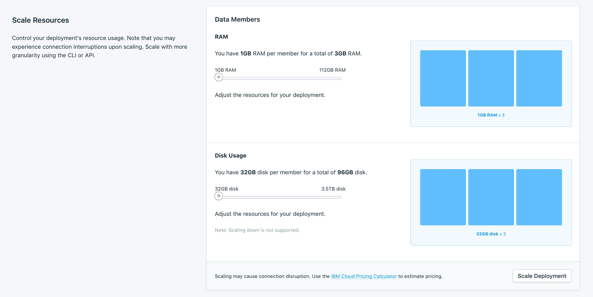

---

Copyright:
  years: 2019
lastupdated: "2019-04-23"

subcollection: databases-for-etcd

---

{:new_window: target="_blank"}
{:shortdesc: .shortdesc}
{:screen: .screen}
{:codeblock: .codeblock}
{:pre: .pre}
{:tip: .tip}

# Managing Resources and Scaling
{: #resources-scaling}

A visual representation of your data members and their resource allocation is available on the _Settings_ tab of your deployment's _Manage_ page. 



{{site.data.keyword.databases-for-etcd_full}} runs with three data members in a cluster, and resources are allocated to all three members equally. For example, the minimum storage of an etcd deployment is 61440 MB, which equates to an initial size of 20480 MB per member. The minimum RAM for an etcd deployment is 3072 MB, which equates to an initial allocation of 1028 MB per member.

Billing is based on the _total_ amount of resources that are allocated to the service.
{: .tip}

**Disk Usage** -
Storage shows the amount of disk space that is allocated to your service. Each member gets an equal share of the allocated space. Disk allocation affects the performance of the disk, with larger disks having higher performance. Baseline Input-Output Operations per second (IOPS) performance for disk is 10 IOPS for each GB. Due to the etcd [8 GB storage limit](https://github.com/etcd-io/etcd/blob/master/Documentation/dev-guide/limit.md), scaling disk space increases only the the IOPS your deployment can handle.

You cannot scale down storage. You can recover space by backing up and restoring to a new deployment.
{: .tip} 

**RAM** -
If you find that your deployment suffers from performance issues due to a lack of memory, you can scale the amount of RAM allocated to your service. The amount of memory you allocate to the deployment is split between the three three members. Adding memory to the total allocation adds memory to the members equally.

## Scaling in the UI

Adjust the slider to increase or decrease the resources that are allocated to your service. The slider controls how much memory or disk is allocated per member. The UI currently uses a coarser-grained resolution of 8 GB increments for disk and 1 GB increments for memory. The UI shows the total allocated memory or disk for the position of the slider. Click **Scale** to trigger the scaling operations and return to the dashboard overview. 

## Resources and Scaling in the CLI 

[{{site.data.keyword.cloud_notm}} CLI cloud databases plug-in](/docs/cli/reference/ibmcloud?topic=cloud-cli-ibmcloud-cli) supports viewing and scaling the resources on your deployment. Use the command `cdb deployment-groups` to see current resource information for your service, including which resource groups are adjustable. To scale any of the available resource groups, use `cdb deployment-groups-set` command. 

For example, the command to view the resource groups for a deployment named "example-deployment":  
`ibmcloud cdb deployment-groups example-deployment`

This produces the output:
```
Group   member
Count   3
|
+   Memory
|   Allocation              3072mb
|   Allocation per member   1024mb
|   Minimum                 3072mb
|   Step Size               384mb
|   Adjustable              true
|
+   Disk
|   Allocation              61440mb
|   Allocation per member   20480mb
|   Minimum                 61440mb
|   Step Size               3072mb
|   Adjustable              true
```

The deployment has three members, with 3072 MB of RAM and 61440 MB of disk allocated in total. The "per member" allocation is 1024 MB of RAM and 20480 MB of disk. The minimum value is the lowest the total allocation can be set. The step size is the smallest amount by which the total allocation can be adjusted.

The `cdb deployment-groups-set` command allows either the total RAM or total disk allocation to be set, in MB. For example, to scale the memory of the "example-deployment" to 2048 MB of RAM for each memory member (for a total memory of 6144 MB), you use the command:  
`ibmcloud cdb deployment-groups-set example-deployment member --memory 6144`

## Scaling via the API

The _Foundation Endpoint_ that is shown on the _Overview_ panel of your service provides the base URL to access this deployment through the API. Use it with the `/groups` endpoint if you need to manage or automate scaling programmatically.

To view the current and scalable resources on a deployment,
```
curl -X GET -H "Authorization: Bearer $APIKEY" `https://api.{region}.databases.cloud.ibm.com/v4/ibm/deployments/{id}/groups'
```

To scale the memory of a deployment to 2048 MB of RAM for each memory member (for a total memory of 6144 MB).
```
curl -X PATCH `https://api.{region}.databases.cloud.ibm.com/v4/ibm/deployments/{id}/groups/member' \
-H "Authorization: Bearer $APIKEY" \
-H "Content-Type: application/json" \
-d '{"memory": {
        "allocation_mb": 6144
      }
    }'
```

More information is in the [API Reference](https://{DomainName}/apidocs/cloud-databases-api#get-currently-available-scaling-groups-from-a-depl).