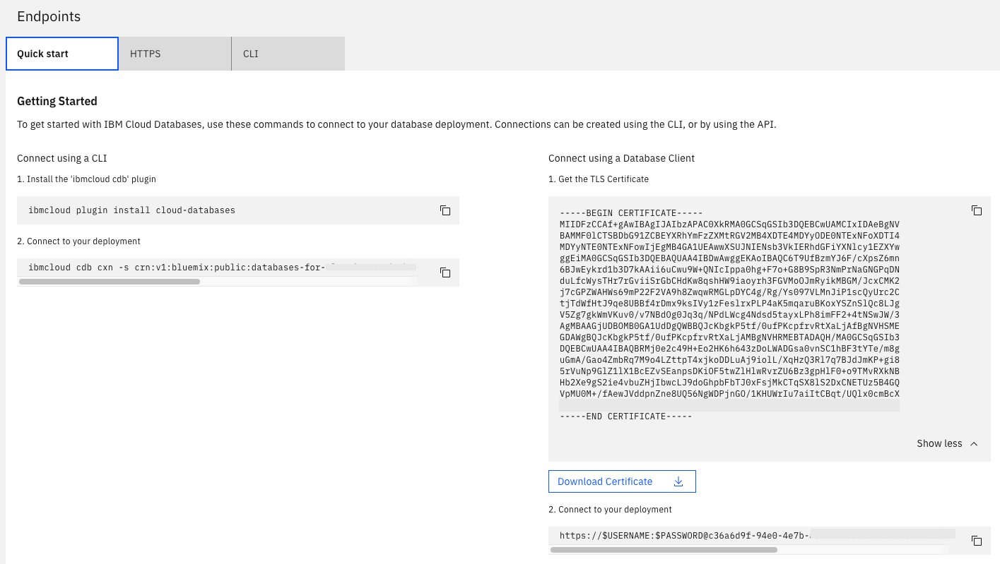

---

Copyright:
  years: 2018, 2020
lastupdated: "2020-04-23"

keywords: deployment, crn, task, gui, api endpoint

subcollection: databases-for-etcd

---

{:new_window: target="_blank"}
{:shortdesc: .shortdesc}
{:screen: .screen}
{:codeblock: .codeblock}
{:pre: .pre}
{:tip: .tip}

# The UI - Dashboard Overview
{: #dashboard-overview}

The _Overview_ page shows you information about your {{site.data.keyword.databases-for-etcd_full}} database. The overview includes essential identifying information.

## Deployment Details

The _Deployment Details_ panel shows a quick description of your deployment.

### Type

The type of database that is offered by the service, and the database version that your service uses. 

### ID

The ID is a [CRN (Cloud Resource Name)](/docs/account?topic=account-crn) which uniquely identifies the database deployment. The CRN is used to refer to the database in the API and can be used with the CLI.

## Recent Tasks

Every time that you make administrative changes to your service (such as scaling, or taking a manual backup), a task starts up. The _Recent Tasks_ panel shows the task name and progress bar for any running tasks, and a list of the most recent completed tasks. Depending on how busy your deployment is, successful tasks can be shown for 24-48 hours. Unsuccessful tasks can show for 7-8 days. Tasks can also be retrieved from the [Cloud Databases API](https://cloud.ibm.com/apidocs/cloud-databases-api#get-currently-running-tasks-on-a-deployment) and [CLI plug-in](https://cloud.ibm.com/docs/databases-cli-plugin?topic=databases-cli-plugin-cdb-reference#deployment-tasks-list). A historical record of tasks from any time period is available through the [Activity Tracker integration](/docs/databases-for-etcd?topic=cloud-databases-activity-tracker).

## Connections

The _Endpoints_ panel contains connection strings for your deployment. Each tab contains connection information tailored to the type of connection or the protocol that uses it. Basic information includes things like _hostname_ and _port_, as well as the TLS self-signed certificate and arguments that can be passed to the driver or binary that you are using to connect. 

Reference tables for the different connection types are available on the [Getting Connection Strings](/docs/databases-for-etcd?topic=databases-for-etcd-connection-strings#connection-string-breakdown) page.

Connection strings reflect whether your deployment uses public endpoints, private endpoints or both. You can configure which endpoints are available on your deployment. For more information, see the [Service Endpoints Integration](/docs/databases-for-etcd?topic=cloud-databases-service-endpoints) page.

## Security

Encryption at rest is enabled for all {{site.data.keyword.databases-for-etcd}} deployments. If you brought your own encryption key from [Key Protect](/docs/databases-for-elasticsearch?topic=cloud-databases-key-protect), the panel provides a link to your Key Protect instance and the _Encryption Key_ field has the name of the key.

## Instance Administration API

You can manage your {{site.data.keyword.databases-for-etcd}} service through the {{site.data.keyword.databases-for}} API. This panel provides the essential information for using the API.

### Foundation Endpoint

The foundation endpoint is the opening stanza of the URL to be used to send API requests to. It combines the region that your service resides in and the base {{site.data.keyword.databases-for}} API endpoint. 

### Deployment ID

Many API calls require the ID of the database deployment. The database deployment's ID/CRN shown here is the same as the ID/CRN shown in the Deployment Details, in a click-to-copy field to make it simpler to use. 

The ID needs to be URL encoded to be used in an API call because the CRN includes a `/`. The `/` character becomes `%2f`.
{: .tip}

### {{site.data.keyword.databases-for}} API Reference

For more information about the {{site.data.keyword.cloud_notm}} databases API, see the [API reference](https://{DomainName}/apidocs/cloud-databases-api) page.

## Resources

The resources tab contains information and configuration options on the size and resource usage of your deployment. You can 
- [Scale disk, memory, and CPU](/docs/databases-for-mongodb?topic=databases-for-mongodb-resources-scaling)
- [Configure Autoscaling](/docs/databases-for-mongodb?topic=databases-for-mongodb-autoscaling)

## Backups

The _Backups_ tab is the UI for managing your deployments backups. All of the available backups are listed with their timestamps. Click on a backup to grab its ID or to restore it into a new deployment. More information is on the [Managing Backups](/docs/databases-for-etcd?topic=cloud-databases-dashboard-backups) page.

## Settings

The _Settings_ tab contains the UI for many of the tunable settings for your deployment. You can 
- [change the root password](/docs/databases-for-etcd?topic=databases-for-etcd-root-password)
- [configure public and private endpoints](/docs/databases-for-etcd?topic=cloud-databases-service-endpoints)
- [implement or modify an IP allowlist](/docs/databases-for-etcd?topic=cloud-databases-allowlisting)

## Observability

The _Observability_ tab provides access to the IBM Cloud monitoring, logging, and event tracking integrations available for your deployment. 
- [Activity Tracker](/docs/databases-for-etcd?topic=cloud-databases-activity-tracker)
- [Logging](/docs/databases-for-etcd?topic=cloud-databases-logging)
- [Monitoring](/docs/databases-for-etcd?topic=databases-for-etcd-sysdig-monitoring)

## Docs

The _Docs_ link opens the main documentation page for {{site.data.keyword.databases-for-etcd}} in a new tab.
