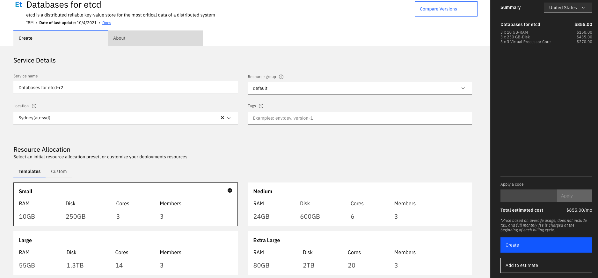

---
copyright:
  years: 2019
lastupdated: "2019-09-07"

keywords: etcd, pricing

subcollection: databases-for-etcd

---

{:new_window: target="_blank"}
{:shortdesc: .shortdesc}
{:screen: .screen}
{:codeblock: .codeblock}
{:pre: .pre}
{:tip: .tip}

# Pricing
{: #pricing}

An {{site.data.keyword.databases-for-etcd_full}} Standard plan deploys as one highly available etcd cluster with three data members. Your data is replicated across members. The Standard plan is priced based on the total amount of disk storage, RAM, dedicated cores, and backup storage that is allocated to deployments, prorated hourly. {{site.data.keyword.databases-for-etcd}} deployments have a minimum of 20 GB of disk (200 IOPS) and 1 GB of RAM per data member. Review the [documentation on performance](/docs/services/databases-for-etcd?topic=databases-for-etcd-high-availability#performance) to see the importance of accounting for IOPS in your capacity planning. 

## Cost Breakdown

**Disk storage per data member** - gigabytes of disk that are allocated to a Databases for etcd data member, or the size of your data.  
**RAM per data member** - gigabytes of RAM that are allocated to a Databases for etcd data member.  
**Backup storage** - amount of storage used for backups by a Databases for etcd deployment.

Resources | Breakdown | Price
-------|-------|-------
20 GB-Month disk | 3 members x 20 GB x $0.58 | $34.80
1 GB-Month RAM | 3 members x 1 GB  x $5 | $15
{: caption="Table 1. Pricing example for two data members" caption-side="top"}

Total per month = $49.80/Month  
Total per hour = $.068/Hour

All prices here are in US dollars. To see pricing in your local currency, you can to use the pricing calculator.
{: .tip}

## Using the Pricing Calculator

For pricing estimation, use the **Add to Estimate** button at the bottom of the [{{site.data.keyword.databases-for-etcd}} catalog page](https://cloud.ibm.com/catalog/services/databases-for-etcd). Input your total consumption across two data members into the calculator. For example, 20 GB of disk and 1 GB of RAM across three data members would be priced at 60 GB of disk and 3 GB of RAM respectively.

## Backups Pricing

Users also receive their total disk space purchased, per database, in free backup storage. For example, in a month, if you have a {{site.data.keyword.databases-for-etcd}} deployment that has provisioned 20 GB of disk per member, which has three data members, you receive 60 GB of backup storage free for that month. If your backup storage utilization is greater than 60 GB for the month in this scenario, each gigabyte is charged at an overage $0.03/month. Most deployments will not ever go over the allotted credit.

## Dedicated Cores Pricing

You have the option of selecting the CPU allocation for your deployment. With dedicated cores, your resource group is given a single-tenant host with a guaranteed minimum reserve of cpu shares. Your deployments are then allocated the number of CPUs you specify. The cost of dedicated cores is $30 per core per month, and each member gets the selected number of cores. For example, if you provision a deployment with 3 dedicated cores per member, that is a total of 9 cores, and billed at $270 per month. 

Dedicated cores are an optional feature. The default `Shared CPU` setting provisions your deployment on hosts with shared compute resources and incurs no additional charge.

## Scaling per Member

{{site.data.keyword.databases-for-etcd}} deployments have minimum and maximum allocation for disk and RAM as shown. Scaling deployments through the API/CLI provides more granularity and also allows a user to scale a database instance up to 4 TB of disk per member.
- Disk minimum - 20 GB per member
- Disk maximum - 4 TB per member
- Disk step granularity through API/CLI - 3072 MB total, 1024 MB per member
- RAM minimum - 1 GB per member
- RAM maximum - 112 GB per member
- RAM step granularity through API/CLI - 384 MB total, 128 MB per member

