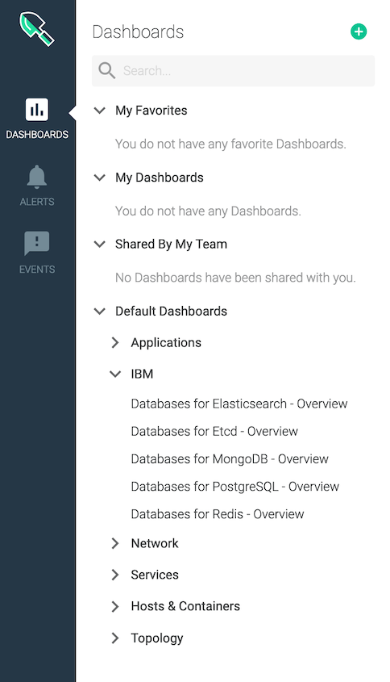

---
copyright:
  years: 2020, 2021
lastupdated: "2021-03-24"

keywords: etcd, monitoring, metrics, iops, disk usage, memory usage

subcollection: databases-for-etcd

---

{:new_window: target="_blank"}
{:shortdesc: .shortdesc}
{:screen: .screen}
{:codeblock: .codeblock}
{:pre: .pre}
{:tip: .tip}
{:important: .important}

# Monitoring Integration
{: #monitoring}

Monitoring for {{site.data.keyword.databases-for-etcd_full}} deployments is provided through integration with the {{site.data.keyword.monitoringfull}} service. Your deployments forward selected information so you can monitor deployment health and resource usage. To see your {{site.data.keyword.databases-for-etcd}} dashboards in {{site.data.keyword.monitoringfull_notm}}, you must [Enable Platform Metrics](/docs/monitoring?topic=monitoring-platform_metrics_enabling) in the same region as your deployment. If you have deployments in more than one region, you must provision monitoring and enable platform metrics in each region.

To access {{site.data.keyword.monitoringfull_notm}} from your deployment, use the _Monitoring_ link from the right menu. (If you do not already have a monitoring service in the same region as your deployment it says _Add monitoring_.)

To access your deployment's monitoring dashboard from {{site.data.keyword.monitoringfull_notm}}, it's in the sidebar, under _IBM_.

## Monitoring Availability

{{site.data.keyword.monitoringfull_notm}} is available for deployments in every region. Deployments in Multi-zone Regions (MZRs) - `eu-gb`, `eu-de`, `us-east`, `us-south`, `jp-tok`, `au-syd` - have their metrics in the corresponding region.

If you have deployments that are in a Single-zone Region (SZR) - `osl01`, `che01`, or `seo01` - then your logs are forwarded to a monitoring instance in another region. You need to provision {{site.data.keyword.monitoringfull_notm}} instances in the region where your metrics are forwarded to. Metrics for deployments in `osl01` go to `eu-gb`. Metrics for deployments in `seo01` and `che01` go to `jp-tok`. 

## Available Metrics
{: metrics-by-plan}

| Metric Name |
|-----------|
| [Disk read latency mean](#ibm_databases_for_etcd_disk_read_latency_mean) | 
| [Disk write latency mean](#ibm_databases_for_etcd_disk_write_latency_mean) | 
| [IO utilization as a percent - 5-minute average](#ibm_databases_for_etcd_disk_io_utilization_percent_average_5m) |
| [IO utilization as a percent - 15-minute average](#ibm_databases_for_etcd_disk_io_utilization_percent_average_15m) | 
| [IO utilization as a percent - 30-minute average](#ibm_databases_for_etcd_disk_io_utilization_percent_average_30m) |  
| [IO utilization as a percent - 60-minute average](#ibm_databases_for_etcd_disk_io_utilization_percent_average_60m) | 
| [IOPS read & write total count for an instance.](#ibm_databases_for_etcd_disk_iops_read_write_total) | 
| [Max allowed memory for an instance.](#ibm_databases_for_etcd_memory_limit_bytes) | 
| [Total disk space for an instance.](#ibm_databases_for_etcd_disk_total_bytes) | 
| [Used CPU for an instance.](#ibm_databases_for_etcd_cpu_used_percent) | 
| [Used disk space for an instance.](#ibm_databases_for_etcd_disk_used_bytes) | 
| [Used memory for an instance.](#ibm_databases_for_etcd_memory_used_bytes) | 
{: caption="Table 1: Available Metrics Reference Table" caption-side="top"}

### Disk read latency mean
{: #ibm_databases_for_etcd_disk_read_latency_mean}

Disk read latency mean

| Metadata | Description |
|----------|-------------|
| `Metric Name` | `ibm_databases_for_etcd_disk_read_latency_mean`|
| `Metric Type` | `gauge` |
| `Value Type`  | `count` |
| `Segment By` | `Service instance` |
{: caption="Table 23: Disk read latency mean metric metadata" caption-side="top"}
### Disk write latency mean
{: #ibm_databases_for_etcd_disk_write_latency_mean}

Disk write latency mean

| Metadata | Description |
|----------|-------------|
| `Metric Name` | `ibm_databases_for_etcd_disk_write_latency_mean`|
| `Metric Type` | `gauge` |
| `Value Type`  | `count` |
| `Segment By` | `Service instance` |
{: caption="Table 27: Disk write latency mean metric metadata" caption-side="top"}
### IO utilization in percent 5-minute average
{: #ibm_databases_for_etcd_disk_io_utilization_percent_average_5m}

How much disk I/O has been used over 5 minutes as a percentage of total disk I/O available

| Metadata | Description |
|----------|-------------|
| `Metric Name` | `ibm_databases_for_etcd_disk_io_utilization_percent_average_5m`|
| `Metric Type` | `gauge` |
| `Value Type`  | `percent` |
| `Segment By` | `Service instance` |
{: caption="Table 2. IO utilization in percent 5 minute average metric metadata" caption-side="top"}

### IO utilization in percent 15-minute average
{: #ibm_databases_for_etcd_disk_io_utilization_percent_average_15m}

How much disk I/O has been used over 15 minutes as a percentage of total disk I/O available.

| Metadata | Description |
|----------|-------------|
| `Metric Name` | `ibm_databases_for_etcd_disk_io_utilization_percent_average_15m`|
| `Metric Type` | `gauge` |
| `Value Type`  | `percent` |
| `Segment By` | `Service instance` |
{: caption="Table 3. IO utilization in percent 15 minute average metric metadata" caption-side="top"}

### IO utilization in percent 30-minute average
{: #ibm_databases_for_etcd_disk_io_utilization_percent_average_30m}

How much disk I/O has been used over 30 minutes as a percentage of total disk I/O available.

| Metadata | Description |
|----------|-------------|
| `Metric Name` | `ibm_databases_for_etcd_disk_io_utilization_percent_average_30m`|
| `Metric Type` | `gauge` |
| `Value Type`  | `percent` |
| `Segment By` | `Service instance` |
{: caption="Table 4. IO utilization in percent 30 minute average metric metadata" caption-side="top"}

### IO utilization in percent 60-minute average
{: #ibm_databases_for_etcd_disk_io_utilization_percent_average_60m}

How much disk I/O has been used over 60 minutes as a percentage of total disk I/O available.

| Metadata | Description |
|----------|-------------|
| `Metric Name` | `ibm_databases_for_etcd_disk_io_utilization_percent_average_60m`|
| `Metric Type` | `gauge` |
| `Value Type`  | `percent` |
| `Segment By` | `Service instance` |
{: caption="Table 5. IO utilization in percent 60 minute average metric metadata" caption-side="top"}

### IOPS read & write total count for an instance
{: #ibm_databases_for_etcd_disk_iops_read_write_total}

How many input/output operations per second your deployment is performing.

| Metadata | Description |
|----------|-------------|
| `Metric Name` | `ibm_databases_for_etcd_disk_iops_read_write_total`|
| `Metric Type` | `gauge` |
| `Value Type`  | `count` |
| `Segment By` | `Service instance` |
{: caption="Table 6. IOPS read & write total count for an instance metric metadata" caption-side="top"}

### Max allowed memory for an instance
{: #ibm_databases_for_etcd_memory_limit_bytes}

The maximum amount of memory available to your deployment.

| Metadata | Description |
|----------|-------------|
| `Metric Name` | `ibm_databases_for_etcd_memory_limit_bytes`|
| `Metric Type` | `gauge` |
| `Value Type`  | `byte` |
| `Segment By` | `Service instance` |
{: caption="Table 7. Max allowed memory for an instance metric metadata" caption-side="top"}

### Total disk space for an instance
{: #ibm_databases_for_etcd_disk_total_bytes}

Represents the total amount of disk available to your deployment.

| Metadata | Description |
|----------|-------------|
| `Metric Name` | `ibm_databases_for_etcd_disk_total_bytes`|
| `Metric Type` | `gauge` |
| `Value Type`  | `byte` |
| `Segment By` | `Service instance` |
{: caption="Table 8. Total disk space for an instance metric metadata" caption-side="top"}

### Used CPU for an instance
{: #ibm_databases_for_etcd_cpu_used_percent}

How much CPU is used as a percentage of total CPU available. Only for deployments that have dedicated CPU.

| Metadata | Description |
|----------|-------------|
| `Metric Name` | `ibm_databases_for_etcd_cpu_used_percent`|
| `Metric Type` | `gauge` |
| `Value Type`  | `percent` |
| `Segment By` | `Service instance` |
{: caption="Table 9. Used CPU for an instance metric metadata" caption-side="top"}

### Used disk space for an instance
{: #ibm_databases_for_etcd_disk_used_bytes}

How much disk your deployment is using.

| Metadata | Description |
|----------|-------------|
| `Metric Name` | `ibm_databases_for_etcd_disk_used_bytes`|
| `Metric Type` | `gauge` |
| `Value Type`  | `byte` |
| `Segment By` | `Service instance` |
{: caption="Table 10. Used disk space for an instance metric metadata" caption-side="top"}

### Used memory for an instance
{: #ibm_databases_for_etcd_memory_used_bytes}

How much memory your deployment is using.

| Metadata | Description |
|----------|-------------|
| `Metric Name` | `ibm_databases_for_etcd_memory_used_bytes`|
| `Metric Type` | `gauge` |
| `Value Type`  | `byte` |
| `Segment By` | `Service instance` |
{: caption="Table 11. Used memory for an instance metric metadata" caption-side="top"}

## Attributes for segmentation
{: attributes}

### Global Attributes
{: global-attributes}

The following attributes are available for segmenting all of the metrics that are listed above

| Attribute | Attribute Name | Attribute Description |
|-----------|----------------|-----------------------|
| `Cloud Type` | `ibm_ctype` | The cloud type is a value of public, dedicated, or local. |
| `Location` | `ibm_location` | The location of the monitored resource - this might be a region, data center, or global. |
| `Resource` | `ibm_resource` | The resource being measured by the service - typically an identifying name or GUID. |
| `Resource Type` | `ibm_resource_type` | The type of the resource being measured by the service. |
| `Scope` | `ibm_scope` | The scope is the account, organization, or space GUID associated with this metric. |
{: caption="Table 12. Global Attributes metadata" caption-side="top"}

### Additional Attributes
{: additional-attributes}

The following attributes are available for segmenting one or more attributes as described in the reference. See the individual metrics for segmentation options.

| Attribute | Attribute Name | Attribute Description |
|-----------|----------------|-----------------------|
| `Service instance` | `ibm_service_instance` | The service instance segment identifies the instance that the metric is associated with. |
{: caption="Table 13. Additional Attributes metadata" caption-side="top"}

