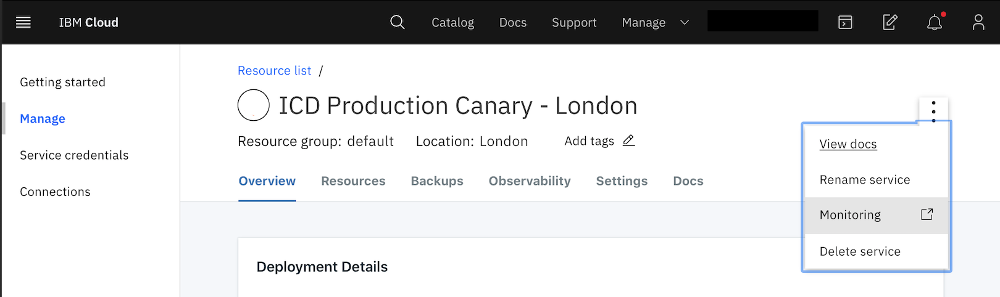

---
copyright:
  years: 2020
lastupdated: "2020-03-02"

keywords: etcd, sysdig, monitoring, metrics, iops, disk usage, memory usage

subcollection: databases-for-etcd

---

{:new_window: target="_blank"}
{:shortdesc: .shortdesc}
{:screen: .screen}
{:codeblock: .codeblock}
{:pre: .pre}
{:tip: .tip}
{:important: .important}

# Sysdig Monitoring Integration
{: #sysdig-monitoring}

Sysdig monitoring is currently only available for deployments in Multi-zone Regions (MZR) -- `eu-gb`, `eu-de`, `us-east`, `us-south`, `jp-tok`, `au-syd`. If you have deployments that are in a Single-zone Region (SZR) -- `osl01`, `che01`, or `seo01` -- then you can still use the [legacy monitoring service](/docs/cloud-databases?topic=cloud-databases-monitoring).
{: important}

To access Sysdig from your deployment, use the _Monitoring_ link from the right menu. (If you do not already have a Sysdig service in the same region as your deployment it says _Add monitoring_.)

To see your {{site.data.keyword.databases-for-etcd_full}} dashboards in Sysdig, you have to [Enable Platform Metrics](/docs/Monitoring-with-Sysdig?topic=Sysdig-platform_metrics_enabling) in the same region as your deployment. If you have deployments in more than one region, you have to provision Sysdig and enable platform metrics in each region.

## Available Metrics
{: metrics-by-plan}

| Metric Name |
|-----------|
| [IO utilization as a percent -  5 minute average](#ibm_databases_for_etcd_disk_io_utilization_percent_average_5m) |
| [IO utilization as a percent - 15 minute average](#ibm_databases_for_etcd_disk_io_utilization_percent_average_15m) | 
| [IO utilization as a percent - 30 minute average](#ibm_databases_for_etcd_disk_io_utilization_percent_average_30m) |  
| [IO utilization as a percent - 60 minute average](#ibm_databases_for_etcd_disk_io_utilization_percent_average_60m) | 
| [IOPS read & write total count for an instance.](#ibm_databases_for_etcd_disk_iops_read_write_total) | 
| [Max allowed memory for an instance.](#ibm_databases_for_etcd_memory_limit_bytes) | 
| [Total disk space for an instance.](#ibm_databases_for_etcd_disk_total_bytes) | 
| [Used CPU for an instance.](#ibm_databases_for_etcd_cpu_used_percent) | 
| [Used disk space for an instance.](#ibm_databases_for_etcd_disk_used_bytes) | 
| [Used memory for an instance.](#ibm_databases_for_etcd_memory_used_bytes) | 
{: caption="Table 1: Available Metrics Reference Table" caption-side="top"}

### IO utilization in percent 5 minute average
{: #ibm_databases_for_etcd_disk_io_utilization_percent_average_5m}

How much disk I/O has been used over 5 minutes as a percentage of total disk I/O available

| Metadata | Description |
|----------|-------------|
| `Metric Name` | `ibm_databases_for_etcd_disk_io_utilization_percent_average_5m`|
| `Metric Type` | `gauge` |
| `Value Type`  | `percent` |
| `Segment By` | `Service instance` |
{: caption="Table 2. IO utilization in percent 5 minute average metric metadata" caption-side="top"}

### IO utilization in percent 15 minute average
{: #ibm_databases_for_etcd_disk_io_utilization_percent_average_15m}

How much disk I/O has been used over 15 minutes as a percentage of total disk I/O available.

| Metadata | Description |
|----------|-------------|
| `Metric Name` | `ibm_databases_for_etcd_disk_io_utilization_percent_average_15m`|
| `Metric Type` | `gauge` |
| `Value Type`  | `percent` |
| `Segment By` | `Service instance` |
{: caption="Table 3. IO utilization in percent 15 minute average metric metadata" caption-side="top"}

### IO utilization in percent 30 minute average
{: #ibm_databases_for_etcd_disk_io_utilization_percent_average_30m}

How much disk I/O has been used over 30 minutes as a percentage of total disk I/O available.

| Metadata | Description |
|----------|-------------|
| `Metric Name` | `ibm_databases_for_etcd_disk_io_utilization_percent_average_30m`|
| `Metric Type` | `gauge` |
| `Value Type`  | `percent` |
| `Segment By` | `Service instance` |
{: caption="Table 4. IO utilization in percent 30 minute average metric metadata" caption-side="top"}

### IO utilization in percent 60 minute average
{: #ibm_databases_for_etcd_disk_io_utilization_percent_average_60m}

How much disk I/O has been used over 60 minutes as a percentage of total disk I/O available.

| Metadata | Description |
|----------|-------------|
| `Metric Name` | `ibm_databases_for_etcd_disk_io_utilization_percent_average_60m`|
| `Metric Type` | `gauge` |
| `Value Type`  | `percent` |
| `Segment By` | `Service instance` |
{: caption="Table 5. IO utilization in percent 60 minute average metric metadata" caption-side="top"}

### IOPS read & write total count for an instance
{: #ibm_databases_for_etcd_disk_iops_read_write_total}

How many input/output operations per second your deployment is performing.

| Metadata | Description |
|----------|-------------|
| `Metric Name` | `ibm_databases_for_etcd_disk_iops_read_write_total`|
| `Metric Type` | `gauge` |
| `Value Type`  | `count` |
| `Segment By` | `Service instance` |
{: caption="Table 6. IOPS read & write total count for an instance metric metadata" caption-side="top"}

### Max allowed memory for an instance
{: #ibm_databases_for_etcd_memory_limit_bytes}

The maximum amount of memory available to your deployment.

| Metadata | Description |
|----------|-------------|
| `Metric Name` | `ibm_databases_for_etcd_memory_limit_bytes`|
| `Metric Type` | `gauge` |
| `Value Type`  | `byte` |
| `Segment By` | `Service instance` |
{: caption="Table 7. Max allowed memory for an instance metric metadata" caption-side="top"}

### Total disk space for an instance
{: #ibm_databases_for_etcd_disk_total_bytes}

Represents the total amount of disk available to your deployment.

| Metadata | Description |
|----------|-------------|
| `Metric Name` | `ibm_databases_for_etcd_disk_total_bytes`|
| `Metric Type` | `gauge` |
| `Value Type`  | `byte` |
| `Segment By` | `Service instance` |
{: caption="Table 8. Total disk space for an instance metric metadata" caption-side="top"}

### Used CPU for an instance
{: #ibm_databases_for_etcd_cpu_used_percent}

How much CPU is used as a percentage of total CPU available. Only for deployments that have dedicated CPU.

| Metadata | Description |
|----------|-------------|
| `Metric Name` | `ibm_databases_for_etcd_cpu_used_percent`|
| `Metric Type` | `gauge` |
| `Value Type`  | `percent` |
| `Segment By` | `Service instance` |
{: caption="Table 9. Used CPU for an instance metric metadata" caption-side="top"}

### Used disk space for an instance
{: #ibm_databases_for_etcd_disk_used_bytes}

How much disk your deployment is using.

| Metadata | Description |
|----------|-------------|
| `Metric Name` | `ibm_databases_for_etcd_disk_used_bytes`|
| `Metric Type` | `gauge` |
| `Value Type`  | `byte` |
| `Segment By` | `Service instance` |
{: caption="Table 10. Used disk space for an instance metric metadata" caption-side="top"}

### Used memory for an instance
{: #ibm_databases_for_etcd_memory_used_bytes}

How much memory your deployment is using.

| Metadata | Description |
|----------|-------------|
| `Metric Name` | `ibm_databases_for_etcd_memory_used_bytes`|
| `Metric Type` | `gauge` |
| `Value Type`  | `byte` |
| `Segment By` | `Service instance` |
{: caption="Table 11. Used memory for an instance metric metadata" caption-side="top"}

## Attributes for Segmentation
{: attributes}

### Global Attributes
{: global-attributes}

The following attributes are available for segmenting all of the metrics listed above

| Attribute | Attribute Name | Attribute Description |
|-----------|----------------|-----------------------|
| `Cloud Type` | `ibm_ctype` | The cloud type is a value of public, dedicated, or local. |
| `Location` | `ibm_location` | The location of the monitored resource - this may be a region, data center, or global. |
| `Resource` | `ibm_resource` | The resource being measured by the service - typically a identifying name or GUID. |
| `Resource Type` | `ibm_resource_type` | The type of the resource being measured by the service. |
| `Resource group` | `ibm_resource_group_name` | The resource group where the service instance was created. |
| `Scope` | `ibm_scope` | The scope is the account, organization, or space GUID associated with this metric. |
| `Service name` | `ibm_service_name` | Name of the service generating this metric. |
{: caption="Table 12. Global Attributes metadata" caption-side="top"}

### Additional Attributes
{: additional-attributes}

The following attributes are available for segmenting one or more attributes as described in the reference. See the individual metrics for segmentation options.

| Attribute | Attribute Name | Attribute Description |
|-----------|----------------|-----------------------|
| `Service instance` | `ibm_service_instance` | The service instance segment identifies the instance the metric is associated with. |
{: caption="Table 13. Additional Attributes metadata" caption-side="top"}

