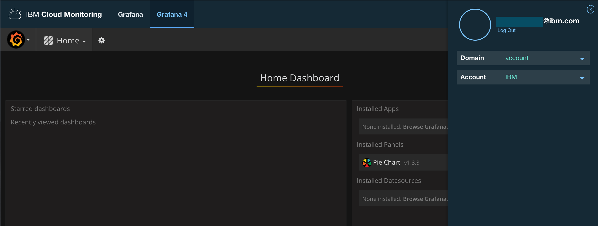
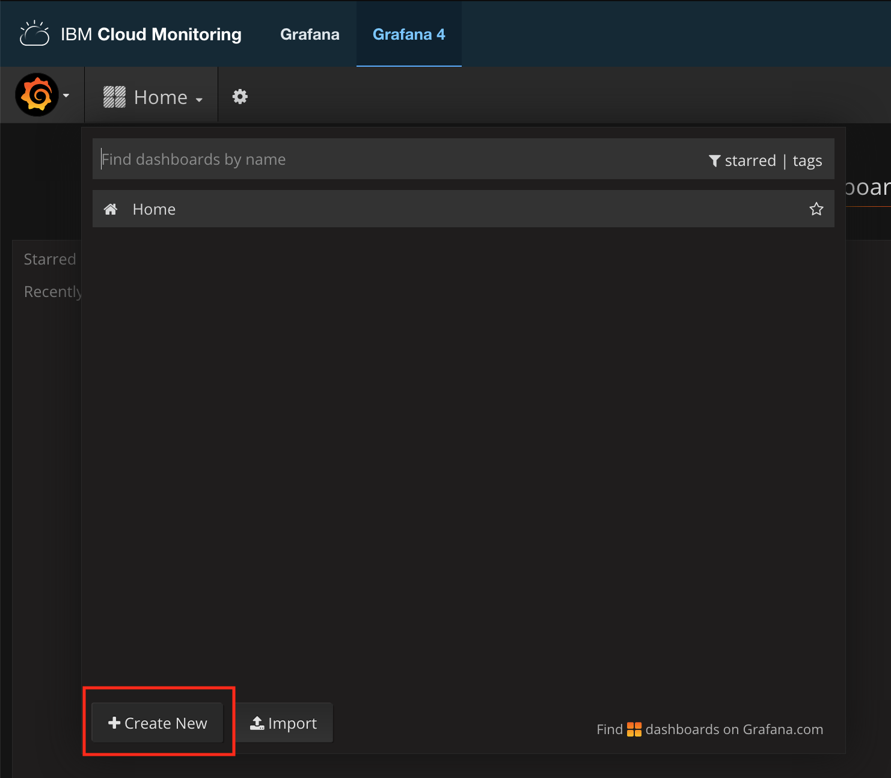
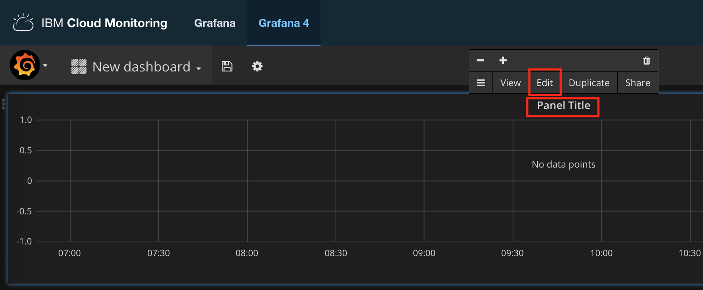
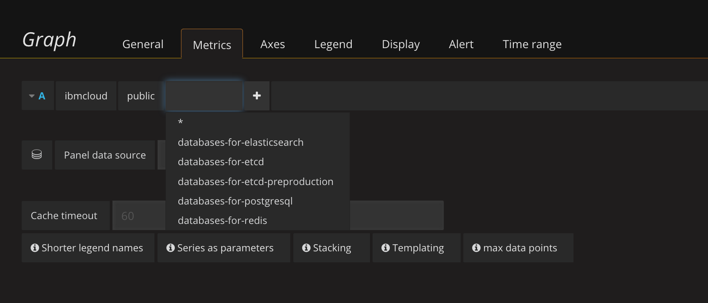
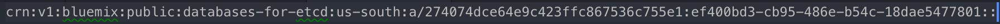
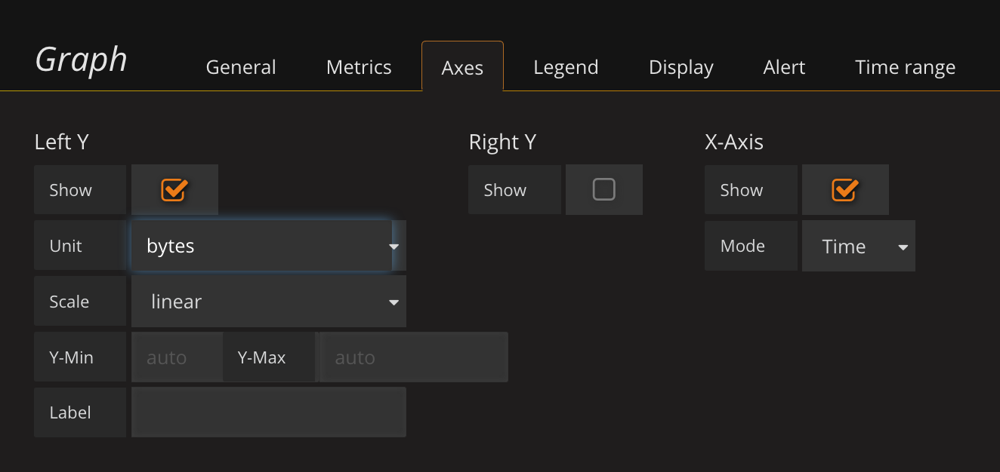
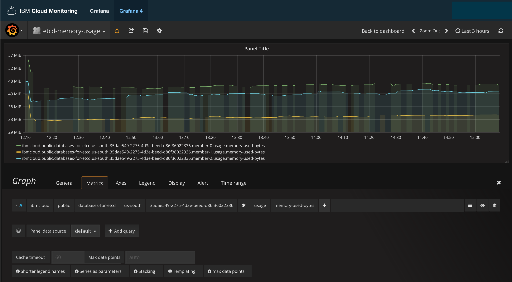
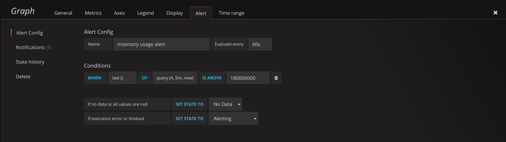

---

Copyright:
  years: 2019
lastupdated: "2019-01-16"
---

{:new_window: target="_blank"}
{:shortdesc: .shortdesc}
{:screen: .screen}
{:codeblock: .codeblock}
{:pre: .pre}
{:tip: .tip}

# Monitoring
{: #monitoring}

Monitoring for {{site.data.keyword.databases-for-etcd_full}} is provided through integration with the {{site.data.keyword.cloud}} Monitoring service. Your deployments forward information about disk space and memory usage so that you can effectively monitor your memory and disk usage. If your deployment outgrows its allocated resources, you can scale up to keep everything running smoothly.

## Configuring IBM Cloud Monitoring

[Provision the Monitoring service](/docs/services/cloud-monitoring/how-to?topic=cloud-monitoring-provision) from the [{{site.data.keyword.cloud_notm}}  catalog](https://cloud.ibm.com/catalog/services/monitoring). Monitoring has a _Lite_ plan available at no additional cost.

Some IBM Cloud regions do not have the monitoring service available. If you have {{site.data.keyword.databases-for}} deployment in a region that is not supported by monitoring, provision monitoring in the region on the table.

Deployment Region|Monitoring Region|UI Link
----------|-----------|-----------
Oslo | Frankfurt | https://metrics.eu-de.bluemix.net
Tokyo | Sydney | https://metrics.au-syd.bluemix.net/
Sydney | Sydney | https://metrics.au-syd.bluemix.net/
Frankfurt | Frankfurt | https://metrics.eu-de.bluemix.net
Dallas | Dallas | https://metrics.ng.bluemix.net/
Washington | Dallas | https://metrics.ng.bluemix.net/
London | London | https://metrics.eu-gb.bluemix.net
{: caption="Table 1. Monitoring service regions" caption-side="top"}

Once provisioned, the Monitoring service under **Cloud Foundry Services** in your **Resource List**. You can access your Monitoring Dashboard by opening the service, or by using a direct link. The direct link depends on what region the monitoring service is in.

By default, the monitoring service displays information that is related to services you have set-up under your Domain, Account, Organization, and Space. {{site.data.keyword.databases-for}} deployments send metrics scoped to the Account level. Click on your account in the upper-left and select "account" from the _Domain_ drop-down menu.

## Configuring a Grafana Graph

To display the usage metrics for your deployment, create a new dashboard. 

Select the format for your information. Click on _Panel Title_ and _Edit_. A configuration section appears and you configure the metrics that you want to display from the _Metrics_ tab.

Click _select metric_ and choose _ibmcloud_. Then, following the form across, select _public_.

Select the service name of the deployment you want to monitor on this graph and the region where it is deployed.

 
After the region field is an ID field. The ID that appears corresponds to the last part of your deployment's ID. For example, if your [Deployment ID](/docs/services/databases-for-etcd?topic=databases-for-etcd-dashboard-overview#id) is,

then the ID in the field is `ef400bd3-cb95-486e-b54c-18dae5477801`.

The next field contains a list of the data members of your deployment. You can customize the graph to show all of the members or just one. The next field is _usage_, the only type of metrics available for {{site.data.keyword.databases-for}}. The last field lists what metrics you can add to be displayed to the graph. You can add all of them or only one of them. 

The final setting to configure is to set the _Axes_. Click the _Axes_ tab. You can uncheck the _Right Y_ axis, and then set the _Left Y_ axis units to _"data (IEC)"_, _bytes_. 

The example graph shows the memory usage for all data members of a deployment.

Once the is graph configured, click the _Save_ icon and give it a name. It appears in your list of dashboards.

## Configuring Alerts

Once you have a graph with the metrics you want to monitor, you can set up alerts to notify you under certain conditions. A complete set-up guide to configuring alerts is on the [Configuring alerts in Grafana](/docs/services/cloud-monitoring/how-to?topic=cloud-monitoring-config_alerts_grafana) page from the Monitoring documentation. Step 1 and Step 2 have you open Grafana and set up a Notification Channel for your alert. Step 3 "Define a Metric" is the configuration of a Graph, such as the example memory resource graph from the previous section. Step 4 defines the alert. For example, an alert for memory usage above 180 MiB is shown.

Be sure to click the _Save_ icon to save the alert.

## Available Metrics

The table describes all the available metrics for {{site.data.keyword.databases-for}} deployments.

Metric | Description
----------|-----------
`disk-total-bytes` | Represents the total amount of disk available to your deployment.
`disk-used-bytes` | How much disk your deployment is using.
`memory-limit-bytes` | The maximum amount of memory available to your deployment. 
`memory-used-bytes` | How much memory your deployment is using.
{: caption="Table 2.{{site.data.keyword.databases-for}} metrics " caption-side="top"}

